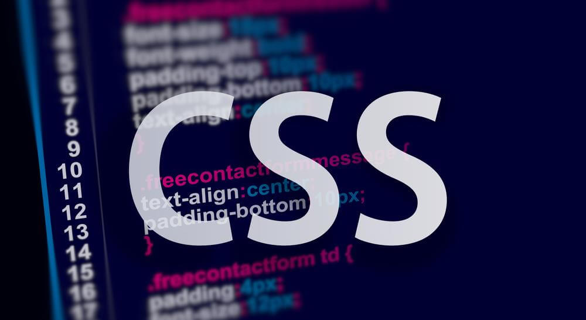

<div align="center">
<br>



</div>


<p align="center">


</p>


<h1 align="center"> Advanced CSS </h1>


<h3 align="center">
<a href="https://github.com/RazikaBengana/holbertonschool-web_front_end/tree/main/CSS_advanced#eye-about">About</a> •
<a href="https://github.com/RazikaBengana/holbertonschool-web_front_end/tree/main/CSS_advanced#hammer_and_wrench-tasks">Tasks</a> •
<a href="https://github.com/RazikaBengana/holbertonschool-web_front_end/tree/main/CSS_advanced#memo-learning-objectives">Learning Objectives</a> •
<a href="https://github.com/RazikaBengana/holbertonschool-web_front_end/tree/main/CSS_advanced#computer-requirements">Requirements</a> •
<a href="https://github.com/RazikaBengana/holbertonschool-web_front_end/tree/main/CSS_advanced#mag_right-resources">Resources</a> •
<a href="https://github.com/RazikaBengana/holbertonschool-web_front_end/tree/main/CSS_advanced#bust_in_silhouette-authors">Authors</a> •
<a href="https://github.com/RazikaBengana/holbertonschool-web_front_end/tree/main/CSS_advanced#octocat-license">License</a>
</h3>

---

<!-- ------------------------------------------------------------------------------------------------- -->

<br>
<br>

## :eye: About

<br>

<div align="center">

**`Advanced CSS`** project focuses on enhancing web page presentation and layout through refined styling techniques.
<br>
Building on an existing `HTML` structure, the repository includes `CSS` files that target various components like forms, layouts, typography, and responsive design.
<br>
This project represents a step forward in web development, elevating the site from basic HTML to a more polished and interactive user experience with advanced CSS.
<br>
<br>
This project has been created by **[Holberton School](https://www.holbertonschool.com/about-holberton)** to enable every student to understand how CSS language works.

</div>

<br>
<br>

### Files you need for the project:

<br>

- #### `favicon.jpg`
  - [download favicon.jpg](https://drive.google.com/file/d/1-LZgRQpPR8TipMwxcRxJXXB2l4o582d8/view?usp=sharing)

<br>


<br>
<br>

- #### `logo-black.png`
  - [download logo-black.png](https://drive.google.com/file/d/1-J2eux0fbQaaOCGGFO27hCtksO2i7pE6/view?usp=sharing)

<br>


<br>
<br>

- #### `logo-white.png`
  - [download logo-white.png](https://drive.google.com/file/d/1-EZTlsBBvE7NGOgqsAftEEvIMrF42OTG/view?usp=sharing)

<br>


<br>
<br>

#### :file_folder: Store all these under a directory named `images`.

<br>
<br>
<br>

### Use the following starter `HTML` file for your project:

<br>
<br>

```yaml
<!DOCTYPE html>
<html lang="en" dir="ltr">
  <head>
    <meta charset="utf-8">
    <meta name="viewport" content="width=device-width, initial-scale=1, viewport-fit=cover">
    <title>Homepage - Techium</title>
    <meta name="description" content="Description of the page less than 150 characters">
    <link rel="icon" type="image/png" href="images/favicon.jpg">
    <link href="https://fonts.googleapis.com/css?family=Open+Sans:400,700|Raleway:700&display=swap" rel="stylesheet">
    <link rel='stylesheet' href='#'>
  </head>
  <body>
    <!-- Header -->
    <header class="header" data-section-theme="dark">
      <div class="container">
        <div class="header-logo">
          <a href="#">
            
          </a>
        </div>
        <nav class="navbar-menu">
          <ul class="nav">
            <li class="nav-item">
              <a href="#" class="nav-link">Home</a>
            </li>
            <li class="nav-item">
              <a href="#services" class="nav-link">Services</a>
            </li>
            <li class="nav-item">
              <a href="#works" class="nav-link">Works</a>
            </li>
            <li class="nav-item">
              <a href="#about" class="nav-link">About</a>
            </li>
            <li class="nav-item">
              <a href="#latest_news" class="nav-link">Latest news</a>
            </li>
            <li class="nav-item">
              <a href="#testimonials" class="nav-link">Testimonials</a>
            </li>
            <li class="nav-item">
              <a href="#contact" class="nav-link">Contact</a>
            </li>
          </ul>
        </nav>
      </div>
    </header>
    <!-- Main -->
    <main>
      <h1 class="visually-hidden">Homepage</h1>
      <!-- Hero section -->
      <section class="section-hero" data-section-theme="dark">
        <div class="container">
          <div class="section-body">
            <section class="section-inner">
              <h2 class="section-title">We help you build your brand</h2>
              <a href="#" class="button">Get Started</a>
            </section>
          </div>
        </div>
      </section>
      <!-- Services section -->
      <section id="services" class="section">
        <div class="container">
          <header class="section-header">
            <h2 class="section-title">Services</h2>
            <p class="section-tagline">We work with you</p>
          </header>
          <div class="section-body">
            <ul class="row">
              <li class="col-1-3">
                <div class="card-services">
                  <h3 class="card-title"><a href="#">Design & Concept</a></h3>
                </div>
              </li>
              <li class="col-1-3">
                <div class="card-services">
                  <h3 class="card-title"><a href="#">Digital Strategy</a></h3>
                </div>
              </li>
              <li class="col-1-3">
                <div class="card-services">
                  <h3 class="card-title"><a href="#">Content Strategy</a></h3>
                </div>
              </li>
            </ul>
            <ul class="row">
              <li class="col-1-3">
                <div class="card-services">
                  <h3 class="card-title"><a href="#">UX Design</a></h3>
                </div>
              </li>
              <li class="col-1-3">
                <div class="card-services">
                  <h3 class="card-title"><a href="#">Web Development</a></h3>
                </div>
              </li>
              <li class="col-1-3">
                <div class="card-services">
                  <h3 class="card-title"><a href="#">Social Media</a></h3>
                </div>
              </li>
            </ul>
          </div>
        </div>
      </section>
      <!-- Works section -->
      <section id="works" class="section" data-section-theme="dark">
        <div class="container">
          <header class="section-header">
            <h2 class="section-title">Works</h2>
            <p class="section-tagline">Take a look at our portfolio</p>
          </header>
          <div class="section-body">
            <ul class="row">
              <li class="col-1-3">
                <article class="card-work">
                  <div class="card-outer">
                    <div class="card-image">
                      
                    </div>
                    <div class="card-inner">
                      <h3 class="card-title"><a href="#">Interior Design</a></h3>
                    </div>
                  </div>
                </article>
              </li>
              <li class="col-1-3">
                <article class="card-work">
                  <div class="card-outer">
                    <div class="card-image">
                      
                    </div>
                    <div class="card-inner">
                      <h3 class="card-title"><a href="#">Web Development</a></h3>
                    </div>
                  </div>
                </article>
              </li>
              <li class="col-1-3">
                <article class="card-work">
                  <div class="card-outer">
                    <div class="card-image">
                      
                    </div>
                    <div class="card-inner">
                      <h3 class="card-title"><a href="#">Personal Development</a></h3>
                    </div>
                  </div>
                </article>
              </li>
            </ul>
          </div>
        </div>
      </section>
      <!-- About Us section -->
      <section id="about" class="section">
        <div class="container">
          <header class="section-header">
            <h2 class="section-title">About Us</h2>
            <p class="section-tagline">Everything about us</p>
          </header>
          <div class="section-body">
            <div class="row">
              <div class="col-1-2">
                
              </div>
              <div class="col-1-2">
                <h3>Who are we</h3>
                <p>Lorem ipsum dolor sit amet, consectetur adipisicing elit. Ipsum, omnis expedita! Eum, praesentium cumque accusantium rem, sit quaerat est nisi ratione, deserunt ducimus quidem iste dicta quibusdam atque maxime cum!</p>
                <h3>Our culture</h3>
                <p>Lorem ipsum dolor sit amet, consectetur adipisicing elit. Ipsum, omnis expedita! Eum, praesentium cumque accusantium rem, sit quaerat est nisi ratione, deserunt ducimus quidem iste dicta quibusdam atque maxime cum!</p>
                <h3>How we work</h3>
                <p>Lorem ipsum dolor sit amet, consectetur adipisicing elit. Ipsum, omnis expedita! Eum, praesentium cumque accusantium rem, sit quaerat est nisi ratione, deserunt ducimus quidem iste dicta quibusdam atque maxime cum!</p>
              </div>
            </div>
          </div>
          <div class="section-footer">
            <a href="#" class="button">Learn more about us</a>
          </div>
        </div>
      </section>
      <!-- Latest news section -->
      <section id="latest_news" class="section">
        <div class="container">
          <header class="section-header">
            <h2 class="section-title">Latest News</h2>
          </header>
          <div class="section-body">
            <ul class="row">
              <li class="col-1-3">
                <article class="card-blog">
                  <div>
                    
                  </div>
                  <p class="card-category">Career</p>
                  <h3><a href="#">Hoc loco tenere se Triarius non potuit.</a></h3>
                  <p>Lorem ipsum dolor sit amet, consectetur adipiscing elit. Id Sextilius factum negabat. Quo tandem modo? At eum nihili facit; Quae contraria sunt his, malane?</p>
                  <small>By Kelly D.</small>
                </article>
              </li>
              <li class="col-1-3">
                <article class="card-blog">
                  <div>
                    
                  </div>
                  <p class="card-category">Digital Life</p>
                  <h3><a href="#">Ut alios omittam, hunc appello, quem ille unum secutus est.</a></h3>
                  <p>Lorem ipsum dolor sit amet, consectetur adipiscing elit. Tum mihi Piso: Quid ergo? Tum ille: Ain tandem? Non autem hoc: igitur ne illud quidem. Sed quod proximum fuit non vidit. Nos commodius agimus. An nisi populari fama?</p>
                  <small>By William A.</small>
                </article>
              </li>
              <li class="col-1-3">
                <article class="card-blog">
                  <div>
                    
                  </div>
                  <p class="card-category">Social</p>
                  <h3><a href="#">Bestiarum vero nullum iudicium puto.</a></h3>
                  <p>Lorem ipsum dolor sit amet, consectetur adipiscing elit. Non igitur bene. Quid enim est a Chrysippo praetermissum in Stoicis? Pugnant Stoici cum Peripateticis. Prioris generis est docilitas, memoria; Apparet statim, quae sint officia, quae actiones.</p>
                  <small>By Frances J.</small>
                </article>
              </li>
            </ul>
          </div>
        </div>
      </section>
      <!-- Testimonials section -->
      <section id="testimonials" class="section">
        <div class="container">
          <header class="section-header">
            <h2 class="section-title">Testimonials</h2>
            <p class="section-tagline">We are more than a digital company</p>
          </header>
          <div class="section-body">
            <ul class="row">
              <li class="col-1-3">
                <article class="card-testimonial">
                  
                  <blockquote class="card-quote">
                    <p>I am completely blown away. Thanks to Techium, we've just launched our 5th website!
                      <cite>Yuri Y.</cite>
                    </p>
                  </blockquote>
                </article>
              </li>
              <li class="col-1-3">
                <article class="card-testimonial">
                  
                  <blockquote class="card-quote">
                    <p>Thank you so much for your help. Techium company is awesome!
                      <cite>Dorrie S.</cite>
                    </p>
                  </blockquote>
                </article>
              </li>
              <li class="col-1-3">
                <article class="card-testimonial">
                  
                  <blockquote class="card-quote">
                    <p>I love your system. Definitely worth the investment. I'd be lost without Techium company.
                      <cite>Sven H.</cite>
                    </p>
                  </blockquote>
                </article>
              </li>
            </ul>
          </div>
        </div>
      </section>
      <!-- Contact section -->
      <section id="contact" class="section">
        <div class="container">
          <header class="section-header">
            <h2 class="section-title">Contact</h2>
            <p class="section-tagline">We'd love to hear from you!</p>
          </header>
          <div class="section-body">
            <p>Lorem ipsum dolor sit amet, consectetur adipiscing elit. Id Sextilius factum negabat. Quo tandem modo? At eum nihili facit; Quae contraria sunt his, malane?</p>
          </div>
          <div class="section-footer">
            <a href="#" class="button">Get in touch</a>
          </div>
        </div>
      </section>
            </main>
    <!-- Footer -->
    <footer class="footer" data-section-theme="dark">
      <div  class="container">
        <div class="row">
          <div class="col-1-2">
            
            <address class="footer-address">
              972 Mission St<br>
              San Francisco, CA<br>
              94103
            </address>
          </div>
          <div class="col-1-2">
            <ul class="social nav">
              <li class="social-item nav-item">
                <a href="https://www.facebook.com/HolbertonSchool/" class="social-link">
                  <svg viewbox="0 0 24 24" xmlns="http://www.w3.org/2000/svg" width="25" height="25">
                    <title>
                      Facebook icon
                    </title>
                    <path d="M23.998 12c0-6.628-5.372-12-11.999-12C5.372 0 0 5.372 0 12c0 5.988 4.388 10.952 10.124 11.852v-8.384H7.078v-3.469h3.046V9.356c0-3.008 1.792-4.669 4.532-4.669 1.313 0 2.686.234 2.686.234v2.953H15.83c-1.49 0-1.955.925-1.955 1.874V12h3.328l-.532 3.469h-2.796v8.384c5.736-.9 10.124-5.864 10.124-11.853z"/>
                  </svg>
                </a>
              </li>
              <li class="social-item nav-item">
                <a href="https://twitter.com/holbertonschool" class="social-link">
                  <svg viewbox="0 0 24 24" xmlns="http://www.w3.org/2000/svg" width="25" height="25">
                    <title>
                      Twitter icon
                    </title>
                    <path d="M23.954 4.569a10 10 0 0 1-2.825.775 4.958 4.958 0 0 0 2.163-2.723c-.951.555-2.005.959-3.127 1.184a4.92 4.92 0 0 0-8.384 4.482C7.691 8.094 4.066 6.13 1.64 3.161a4.822 4.822 0 0 0-.666 2.475c0 1.71.87 3.213 2.188 4.096a4.904 4.904 0 0 1-2.228-.616v.061a4.923 4.923 0 0 0 3.946 4.827 4.996 4.996 0 0 1-2.212.085 4.937 4.937 0 0 0 4.604 3.417 9.868 9.868 0 0 1-6.102 2.105c-.39 0-.779-.023-1.17-.067a13.995 13.995 0 0 0 7.557 2.209c9.054 0 13.999-7.496 13.999-13.986 0-.209 0-.42-.015-.63a9.936 9.936 0 0 0 2.46-2.548l-.047-.02z"/>
                  </svg>
                </a>
              </li>
              <li class="social-item nav-item">
                <a href="https://www.instagram.com/holbertonschool/" class="social-link">
                  <svg viewbox="0 0 24 24" xmlns="http://www.w3.org/2000/svg" width="25" height="25">
                    <title>
                      Instagram icon
                    </title>
                    <path d="M12 0C8.74 0 8.333.015 7.053.072 5.775.132 4.905.333 4.14.63c-.789.306-1.459.717-2.126 1.384S.935 3.35.63 4.14C.333 4.905.131 5.775.072 7.053.012 8.333 0 8.74 0 12s.015 3.667.072 4.947c.06 1.277.261 2.148.558 2.913a5.885 5.885 0 0 0 1.384 2.126A5.868 5.868 0 0 0 4.14 23.37c.766.296 1.636.499 2.913.558C8.333 23.988 8.74 24 12 24s3.667-.015 4.947-.072c1.277-.06 2.148-.262 2.913-.558a5.898 5.898 0 0 0 2.126-1.384 5.86 5.86 0 0 0 1.384-2.126c.296-.765.499-1.636.558-2.913.06-1.28.072-1.687.072-4.947s-.015-3.667-.072-4.947c-.06-1.277-.262-2.149-.558-2.913a5.89 5.89 0 0 0-1.384-2.126A5.847 5.847 0 0 0 19.86.63c-.765-.297-1.636-.499-2.913-.558C15.667.012 15.26 0 12 0zm0 2.16c3.203 0 3.585.016 4.85.071 1.17.055 1.805.249 2.227.415.562.217.96.477 1.382.896.419.42.679.819.896 1.381.164.422.36 1.057.413 2.227.057 1.266.07 1.646.07 4.85s-.015 3.585-.074 4.85c-.061 1.17-.256 1.805-.421 2.227a3.81 3.81 0 0 1-.899 1.382 3.744 3.744 0 0 1-1.38.896c-.42.164-1.065.36-2.235.413-1.274.057-1.649.07-4.859.07-3.211 0-3.586-.015-4.859-.074-1.171-.061-1.816-.256-2.236-.421a3.716 3.716 0 0 1-1.379-.899 3.644 3.644 0 0 1-.9-1.38c-.165-.42-.359-1.065-.42-2.235-.045-1.26-.061-1.649-.061-4.844 0-3.196.016-3.586.061-4.861.061-1.17.255-1.814.42-2.234.21-.57.479-.96.9-1.381.419-.419.81-.689 1.379-.898.42-.166 1.051-.361 2.221-.421 1.275-.045 1.65-.06 4.859-.06l.045.03zm0 3.678a6.162 6.162 0 1 0 0 12.324 6.162 6.162 0 1 0 0-12.324zM12 16c-2.21 0-4-1.79-4-4s1.79-4 4-4 4 1.79 4 4-1.79 4-4 4zm7.846-10.405a1.441 1.441 0 0 1-2.88 0 1.44 1.44 0 0 1 2.88 0z"/>
                  </svg>
                </a>
              </li>
            </ul>
          </div>
        </div>
        <hr>
        <div class="row">
          <div class="col-1-2">
            <p class="footer-copyright">© 2020 Techium, made with ♥ by students at Holberton School.</p>
          </div>
          <div class="col-1-2">
            <ul class="footer-nav nav">
              <li class="footer-nav-item nav-item">
                <a href="#" class="footer-nav-link">Terms of use</a>
              </li>
              <li class="footer-nav-item nav-item">
                <a href="#" class="footer-nav-link">Privacy Policy</a>
              </li>
              <li class="footer-nav-item nav-item">
                <a href="#" class="footer-nav-link">Cookie Policy</a>
              </li>
            </ul>
          </div>
        </div>
      </div>
    </footer>
  </body>
</html>
```
<br>
<br>

#### :flashlight: You can save it in a `index.html` file and replace the `<link rel='stylesheet' href='#'>` by the right `CSS` file.

<br>
<br>
<br>

### End goal of the project:

<br>
<br>


<br>
<br>

#### :warning: Important note:

**Details are important!** lowercase vs uppercase / wrong letter… be careful!

<br>
<br>

<!-- ------------------------------------------------------------------------------------------------- -->

## :hammer_and_wrench: Tasks

<br>

**`0. Let's get some images!`**

**`1. Effortless transitions when scrolling`**

**`2. Do you know your color values?`**

**`3. Reuse and repeat. A programmer's life should be simple with variables`**

**`4. Variables for storing certain font types`**

**`5. Variables for the font size`**

**`6. Variables for the font-weight`**

**`7. Integrating Google Fonts into the CSS file`**

**`8. Defining line heights`**

**`9. Links are decorated by default, time to remove them`**

**`10. Centering the section titles`**

**`11. Add more styles to the section tagline`**

**`12. Adding more styling to the section title`**

**`13. Pseudo Classes`**

**`14. Resetting the CSS stylesheet for browser consistency`**

**`15. Add universal box-sizing`**

**`16. Styling the container`**

**`17. Adding padding to sections`**

**`18. Customizing the navbar`**

**`19. Grid styling and custom variables`**

**`20. Clear the context of the grid`**

**`21. Simplify the col- selector`**

**`22. Add a dark theme to sections`**

**`23. Fix issues for dark theme`**

**`24. Add background and hover state to services`**

**`25. Add border to the button`**

**`26. Add border radius to images`**

**`27. Styling the section hero`**

**`28. Fixing the header and menu navigation bar`**

**`29. Styling and custom properties for the nav`**

**`30. Fix the works section`**

**`31. Add quotes decoration on testimonials`**

**`32. Incorporating transitions`**

<br>
<br>

<!-- ------------------------------------------------------------------------------------------------- -->

## :memo: Learning objectives

<br>

**_You are expected to be able to [explain to anyone](https://fs.blog/feynman-learning-technique/), without the help of Google:_**

<br>

```diff

+ Selectors, properties, and values

+ The difference between block and inline styling

+ How to ensure consistency across all browers (CSS reset)

+ How to setup CSS variables

+ The differences between inline, embeded and external CSS

+ How grid systems work (with floats)

+ The difference between icons webfonts and SVG icons

+ The difference between pseudo-classes and pseudo-elements

+ How to make background gradients

+ How to animate elements in CSS

+ How to transform (2d, 3d) elements

+ What vendor prefixes are

```

<br>
<br>

<!-- ------------------------------------------------------------------------------------------------- -->

## :computer: Requirements

<br>

```diff

General

+ Allowed editors: vi, vim, emacs, VSCode, Atom

+ All your files will be interpreted on Chrome (version 78.x)

+ All your files should end with a new line

+ All your files should start by a comment describing the task

+ A README.md file, at the root of the folder of the project, is mandatory

+ Your code should be W3C compliant and validate with W3C-Validator

```

<br>

**_Why all your files should end with a new line? See [HERE](https://unix.stackexchange.com/questions/18743/whats-the-point-in-adding-a-new-line-to-the-end-of-a-file/18789)_**

<br>
<br>

<!-- ------------------------------------------------------------------------------------------------- -->

## :mag_right: Resources

<br>

**_Do you need some help?_**

<br>

**Concepts:**

* [CSS fundamentals](https://drive.google.com/file/d/1--FIf98jV4yyWiYKgWedqkHbgGIq5bZ7/view?usp=sharing)

* [CSS advanced](https://drive.google.com/file/d/1-6dfRwGu4Zwz7ms6yw_FDAV4l9hLJN2n/view?usp=sharing)

<br>

**Read or watch:**

* [CSS Reference - A free visual guide to CSS](https://cssreference.io/)

* [Can I use,,, Support tables for HTML5, CSS3, etc](https://caniuse.com/)

* [CSS Reference](http://ref.openweb.io/CSS/)

* [CSS Properties | HTML Dog](https://htmldog.com/references/css/properties/)

* [Box Sizing](https://css-tricks.com/box-sizing/)

* [CSS Specificity](https://developer.mozilla.org/en-US/docs/Web/CSS/Specificity)

* [CSS specificity calculator](https://www.codecaptain.io/tools/css-specificity-calculator)

* [Play with CSS selector](https://frontend30.com/css-selectors-cheatsheet/)

<br>
<br>

<!-- ------------------------------------------------------------------------------------------------- -->

## :bust_in_silhouette: Authors

<br>

**${\color{blue}Razika \space Bengana}$**

<br>
<br>

<!-- ------------------------------------------------------------------------------------------------- -->

## :octocat: License

<br>

```Advanced CSS``` _project has no license specified._

<br>
<br>

---

<p align="center"><br>2022</p>