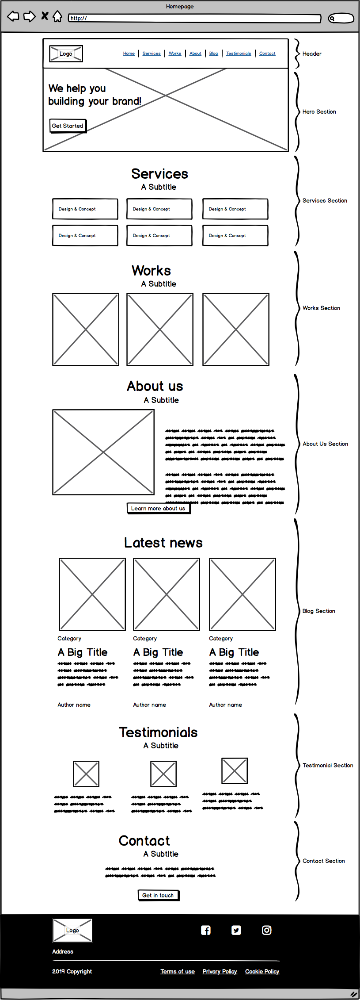

<div align="center">
<br>


</div>


<p align="center">


</p>


<h1 align="center"> Advanced HTML </h1>


<h3 align="center">
<a href="https://github.com/RazikaBengana/holbertonschool-web_front_end/tree/main/html_advanced#eye-about">About</a> •
<a href="https://github.com/RazikaBengana/holbertonschool-web_front_end/tree/main/html_advanced#hammer_and_wrench-tasks">Tasks</a> •
<a href="https://github.com/RazikaBengana/holbertonschool-web_front_end/tree/main/html_advanced#memo-learning-objectives">Learning Objectives</a> •
<a href="https://github.com/RazikaBengana/holbertonschool-web_front_end/tree/main/html_advanced#computer-requirements">Requirements</a> •
<a href="https://github.com/RazikaBengana/holbertonschool-web_front_end/tree/main/html_advanced#mag_right-resources">Resources</a> •
<a href="https://github.com/RazikaBengana/holbertonschool-web_front_end/tree/main/html_advanced#bust_in_silhouette-authors">Authors</a> •
<a href="https://github.com/RazikaBengana/holbertonschool-web_front_end/tree/main/html_advanced#octocat-license">License</a>
</h3>

---

<!-- ------------------------------------------------------------------------------------------------- -->

<br>
<br>

## :eye: About

<br>

<div align="center">

**`Advanced HTML`** project aims to deepen understanding of `HTML` by creating structured web pages using semantic elements, style guides, and favicons.
<br>
It emphasizes the importance of clean, maintainable code while exploring features like forms, links, and media elements.
<br>
The project focuses on the foundational steps to build well-structured, accessible, and visually appealing web pages.
<br>
<br>
This project has been created by **[Holberton School](https://www.holbertonschool.com/about-holberton)** to enable every student to understand how HTML language works.

</div>

<br>
<br>

<h1 align="center">
Welcome!
</h1>

<br>

### `Techium` - Project overview:

<br>
<br>

In this project, you will learn how to use `HTML` tags to structure a web page. <br>
No `CSS`, no styling - don’t worry, the final page will be “ugly” it’s normal, it’s not the purpose of this project. <br>

<br>

#### :warning: Important note:

**Details are important!** lowercase vs uppercase / wrong letter… be careful!

<br>
<br>

### Sitemap of the project:

<br>
<br>


<br>
<br>

### Wireframe of the project:

<br>
<br>



<br>
<br>

<!-- ------------------------------------------------------------------------------------------------- -->

## :hammer_and_wrench: Tasks

<br>

**`0. Create your first webpage`**

**`1. Structure your webpage`**

**`2. The head - meta charset, viewport, title, description, favicons`**

**`3. Simple header, main, footer`**

**`4. Aside`**

**`5. Section`**

**`6. Work, News, Testimonial articles`**

**`7. Navigation`**

**`8. Level 1 headings`**

**`9. Level 2 headings`**

**`10. Level 3 headings`**

**`11. styleguide`**

**`12. Paragraphs`**

**`13. styleguide paragraphs`**

**`14. Span`**

**`15. Div`**

**`16. Structure your sections`**

**`17. Comments`**

**`18. link your logo`**

**`19. Create new pages`**

**`20. Add links`**

**`21. Add social media links`**

**`22. "Button" links`**

**`23. Services, Works, Latest news links`**

**`24. List the links`**

**`25. Secondary navigation menu`**

**`26. Examples of lists for the styleguide`**

**`27. Separate content`**

**`28. Horizontal rule example`**

**`29. Client quotes`**

**`30. Examples of quotes`**

**`31. Address and latest news authors`**

**`32. Typography section - using the correct tags`**

**`33. Table`**

**`34. Details`**

**`35. Replace text logo with image logo`**

**`36. Add images to your sections`**

**`37. Social icons`**

**`38. Add a video player in the styleguide`**

**`39. Add an audio player in the styleguide`**

**`40. Add a iframe example in the styleguide`**

<br>
<br>

<!-- ------------------------------------------------------------------------------------------------- -->

## :memo: Learning Objectives

<br>

**_You are expected to be able to [explain to anyone](https://fs.blog/feynman-learning-technique/), without the help of Google:_**

<br>

```diff

+ Which guidelines to follow for HTML

+ How to create the skeleton of an HTML5 page

+ How to use semantic HTML tags to structure a web page

+ Which use cases to use div vs span

+ The semantic value’s of header, main, footer, article, nav, section, aside

+ How to use headings (and why it’s important to follow the hierarchical order)

+ How to make lists in HTML

+ The differences between medias (SVG, GIF, PNG, JPG)

+ How to structure data in a table

+ How to integrate a video in a webpage

+ How to integrate an audio file in a webpage

+ How to embed external content

+ How to correctly structure an HTML page

```

<br>
<br>

<!-- ------------------------------------------------------------------------------------------------- -->

## :computer: Requirements

<br>

```diff

+ A README.md file at the root of the folder of the project is mandatory

+ Your code should be W3C compliant and validate with W3C-Validator

+ Techium will be the name of the company we will use across our webpages

```

<br>

**_Why all your files should end with a new line? See [HERE](https://unix.stackexchange.com/questions/18743/whats-the-point-in-adding-a-new-line-to-the-end-of-a-file/18789)_**

<br>
<br>

<!-- ------------------------------------------------------------------------------------------------- -->

## :mag_right: Resources

<br>

**_Do you need some help?_**

<br>

**Concepts:**

* [HTML - elements of a web page](https://drive.google.com/file/d/15WToKRGjZH3uOACuubRZntNCPWt3bPTz/view?usp=sharing)

<br>

**Read or watch:**

* [HTML 5.2](https://html.spec.whatwg.org/multipage/)

* [HTML: HyperText Markup Language | MDN](https://developer.mozilla.org/en-US/docs/Web/HTML)

* [HTML Reference - A free guide to all HTML elements and attributes](https://htmlreference.io/)

* [Can I use… Support tables for HTML5, CSS3, etc](https://caniuse.com/)

* [HTML Cheat Sheet - WebsiteSetup](https://websitesetup.org/html5-cheat-sheet/)

<br>
<br>

<!-- ------------------------------------------------------------------------------------------------- -->

## :bust_in_silhouette: Authors

<br>


<br>
<br>

<!-- ------------------------------------------------------------------------------------------------- -->

## :octocat: License

<br>

```Advanced HTML``` _project has no license specified._

<br>
<br>

---

<p align="center"><br>2022</p>